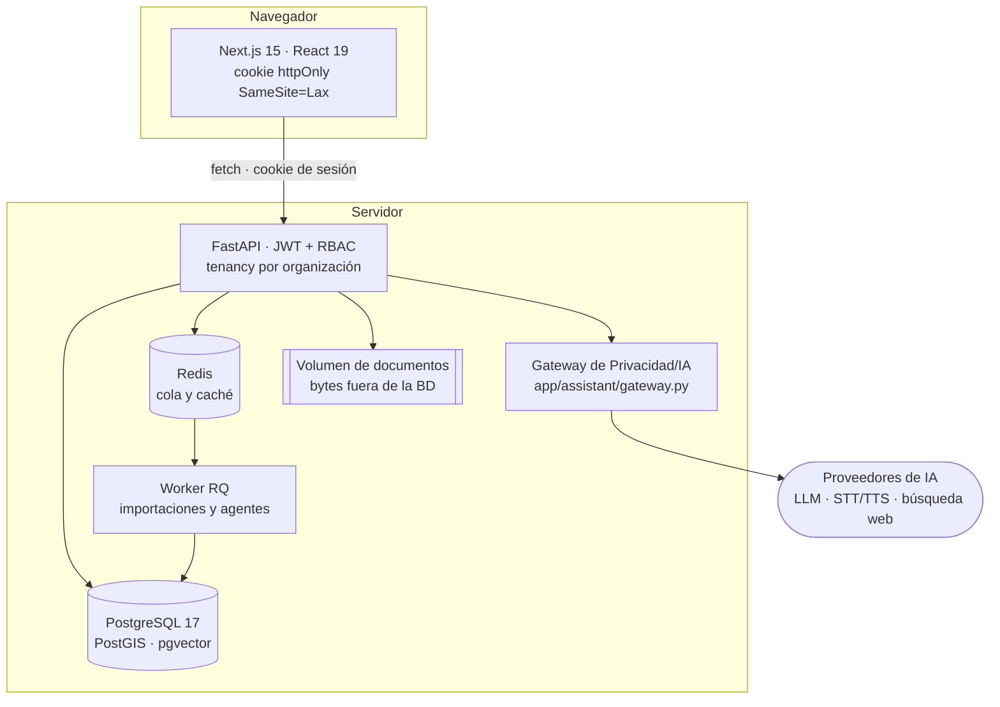

<p align="center">
  
</p>

<h1 align="center">Anacleto</h1>

<p align="center">
  <strong>Agente operativo municipal.</strong><br>
  Plataforma de gestión para ayuntamientos pequeños, con un asistente de IA
  supervisado por personas.
</p>

<p align="center">
  <a href="https://github.com/aloantony/asistente_ayuntamientos/actions/workflows/ci.yml"></a>
  
  
  
  
</p>

<p align="center">
  <a href="#arranque-rápido">Arranque rápido</a> ·
  <a href="#qué-incluye">Módulos</a> ·
  <a href="#arquitectura">Arquitectura</a> ·
  <a href="#documentación">Documentación</a> ·
  <a href="README.en.md">English</a>
</p>

---

> [!IMPORTANT]
> **Código visible, no código abierto.** Puedes leer, auditar y probar el código
> en tu máquina. Usarlo en producción o prestar un servicio con él requiere un
> acuerdo escrito previo. Ver [LICENSE](LICENSE).

## Qué es

Un ayuntamiento de 500 habitantes tiene las mismas obligaciones legales que uno
de 50.000 y una fracción del personal. Anacleto es la herramienta interna de
trabajo de ese ayuntamiento: reúne en un sitio el expediente, el inventario, la
normativa, el mantenimiento y el mapa del municipio, y pone encima un asistente
de IA que entiende ese contexto y ayuda a completar el trabajo.

El asistente **no decide solo**. Todo lo que propone —una necesidad recogida en
conversación, una ordenanza importada, un recuerdo institucional— entra como
borrador y necesita que una persona con permiso lo apruebe. Cada llamada a una
herramienta deja rastro auditable.

**Lo que no es:** no es un portal de atención a la ciudadanía, no es una
herramienta de actividad política o electoral, y no sustituye el criterio del
secretario ni del técnico municipal.

La visión completa del producto está en
[`docs/vision-producto.md`](docs/vision-producto.md).

## Estado del proyecto

| | |
|---|---|
| **Fase** | Piloto en producción con un ayuntamiento real |
| **Multi-tenant** | Sí, por organización, como frontera de seguridad implementada |
| **API** | Sin versionar todavía: puede cambiar sin aviso entre commits |
| **Tests** | ~936 tests de backend (pytest) + 17 suites de frontend (vitest) |
| **Decisiones** | 63 ADR registradas en [`docs/decisiones.md`](docs/decisiones.md) |
| **Idiomas** | Interfaz en español; código y commits en inglés |

Es un proyecto en evolución activa y de un solo autor. Si te planteas usarlo,
lee antes [Privacidad y seguridad](#privacidad-y-seguridad).

## Qué incluye

| Área | Ruta | Qué resuelve |
|---|---|---|
| **Anacleto** | `/asistente` | Conversación por texto y voz con el asistente, con herramientas municipales sujetas a los permisos de quien pregunta |
| **Ayuntamiento** | `/ayuntamiento` | Ficha del municipio, escudo, secciones configurables, personal y puestos |
| **Mapa** | `/mapa` | Plano del municipio con necesidades, proyectos y bienes situados sobre él; selección por área y exportación CSV |
| **Ordenanzas** | `/ordenanzas` | Biblioteca de normativa municipal, importación desde fuentes oficiales y matriz comparativa entre municipios |
| **Necesidades** | `/requisitos` | Recogida estructurada de necesidades y peticiones, incluidas las que captura el asistente |
| **Proyectos** | `/proyectos` | Expedientes y áreas de trabajo, con sus documentos |
| **Inventario** | `/inventario` | Bienes e instalaciones municipales |
| **Mantenimiento** | `/mantenimiento` | Partes e incidencias sobre esos bienes |
| **Sede electrónica** | `/sede` | Tablón, trámites, tributos, perfil de contratante, transparencia y plenos |
| **Hoja de ruta** | `/hoja-de-ruta` | Planificación municipal a la vista de todos |
| **Administración** | `/admin/*` | Usuarios, grupos, roles y permisos, municipios, memoria institucional y organizaciones |

El detalle funcional de cada módulo está en [`docs/`](docs/README.md).

## Arranque rápido

Necesitas **Docker** y **Docker Compose**. Nada más: PostgreSQL, Redis, el
backend y el frontend se levantan en contenedores.

```bash
git clone git@github.com:aloantony/asistente_ayuntamientos.git
cd asistente_ayuntamientos
cp .env.example .env
```

Abre `.env` y revisa al menos `SECRET_KEY`, `BOOTSTRAP_ADMIN_TOKEN`,
`CORS_ALLOWED_ORIGINS` y `NEXT_PUBLIC_API_BASE_URL`. Después:

```bash
docker compose up -d --build
docker compose exec backend alembic upgrade head
```

Crea el primer administrador (sólo funciona mientras no exista ningún usuario):

```bash
curl -X POST http://localhost:8000/auth/bootstrap-admin \
  -H "Content-Type: application/json" \
  -H "X-Bootstrap-Admin-Token: dev-bootstrap-token" \
  -d '{"email":"admin@example.com","password":"cambia-esto-ya","full_name":"Admin"}'
```

Ya puedes entrar:

| Servicio | URL |
|---|---|
| Frontend | http://localhost:3000 |
| Backend | http://localhost:8000 |
| Salud | http://localhost:8000/health |
| API interactiva (OpenAPI) | http://localhost:8000/docs |

Los cuatro servicios escuchan **sólo en localhost**. PostgreSQL y Redis no se
publican nunca. La documentación interactiva de la API describe las ~132 rutas y
por eso se sirve **únicamente con `ENVIRONMENT=development`**: en producción
`/docs`, `/redoc` y `/openapi.json` devuelven 404 a propósito.

### El asistente necesita configuración aparte

Sin un runtime de IA configurado, los endpoints del asistente devuelven `503` a
propósito: **no es un fallo**. La opción más corta es Anthropic:

```dotenv
ASSISTANT_RUNTIME=anthropic
ANTHROPIC_API_KEY=sk-ant-...
```

Hay otros runtimes (OpenAI Responses, Hermes Agent, y un puente local de Codex
sólo para desarrollo), voz realtime, STT/TTS de respaldo, búsqueda web
controlada y canal de Telegram. Todo eso viene documentado opción por opción en
[`.env.example`](.env.example) y explicado en
[README.en.md §8](README.en.md#8-local-development-setup).

## Arquitectura



Cuatro reglas sostienen el diseño:

1. **Toda salida a IA pasa por el gateway.** Ningún otro módulo llama a un
   proveedor externo. Se envía sólo texto de conversación, memoria institucional
   aprobada y campos que ha escrito el usuario; nunca documentos originales ni
   ficheros municipales. Se registran metadatos (runtime, modelo, tokens), nunca
   contenido.
2. **La cadena de acceso es usuario → grupo → rol → permiso**, con `Organization`
   como frontera de tenencia. `Municipality` es dato de referencia global
   compartido, que es otra cosa.
3. **Los bytes no viven en la base de datos.** Los documentos van al sistema de
   ficheros con clave de almacenamiento generada por el servidor, lista blanca
   de tipos y tope de tamaño; PostgreSQL guarda los metadatos.
4. **Archivar antes que borrar.** Los objetos de negocio se archivan o cambian de
   estado en lugar de desaparecer.

Detalle técnico en [`docs/arquitectura.md`](docs/arquitectura.md); el porqué de
cada decisión, en [`docs/decisiones.md`](docs/decisiones.md).

## Documentación

Empieza por el [índice de `docs/`](docs/README.md). Los cuatro que más se usan:

| Documento | Para qué |
|---|---|
| [`docs/vision-producto.md`](docs/vision-producto.md) | Qué quiere ser Anacleto y dónde están sus límites |
| [`docs/arquitectura.md`](docs/arquitectura.md) | Estado técnico actual |
| [`docs/decisiones.md`](docs/decisiones.md) | Las 63 ADR, con el contexto de cada decisión |
| [`docs/despliegue.md`](docs/despliegue.md) | Runbook de producción completo |

`README.en.md` conserva la referencia operativa exhaustiva en inglés: cada
variable de entorno, cada runtime y cada garantía de seguridad del lector web y
de los adjuntos.

## Desarrollo

Antes de entregar un cambio, pasa la validación completa. Los tests del backend
corren contra PostgreSQL en una base `app_test_<uuid>` aislada que se destruye
al terminar:

```bash
docker compose run --rm -T -v "$(pwd)/backend:/app" backend \
  sh -c "pip install -q -r requirements-dev.txt && python -m pytest tests/ -q -o cache_dir=/tmp/pytest_cache"
```

```bash
python3 -m compileall -q backend/app backend/alembic
npm --prefix frontend run typecheck
npm --prefix frontend run lint
npm --prefix frontend test
npm --prefix frontend run build
git diff --check
```

CI ejecuta lo equivalente en cada pull request y la rama `main` exige que pase
antes de fusionar. Cómo trabajar aquí —ramas, commits, ADR, migraciones— está en
[CONTRIBUTING.md](CONTRIBUTING.md).

## Despliegue

Producción va en un fichero Compose propio, con Caddy terminando TLS y un único
hostname: frontend en `/` y API bajo `/api`.

```bash
docker compose --env-file .env.production -f docker-compose.prod.yml up -d --build
docker compose --env-file .env.production -f docker-compose.prod.yml exec backend alembic upgrade head
```

El runbook completo —endurecimiento del servidor, DNS, secretos, retirada del
bootstrap, copias de seguridad y ensayo de restauración— está en
[`docs/despliegue.md`](docs/despliegue.md).

> [!WARNING]
> Los volúmenes `postgres_data` y `document_storage` son datos de usuario. No
> uses `docker compose down -v`, `docker volume prune` ni
> `docker system prune -a --volumes`. Para recuperar espacio, `docker builder prune`.

## Privacidad y seguridad

Esto maneja datos de administraciones públicas españolas, así que conviene ser
explícito sobre lo que está resuelto y lo que no.

**Resuelto:** cookie de sesión `httpOnly`, limitación de intentos de acceso,
aislamiento por organización en cada endpoint, tabla `security_events`
inmutable por trigger de PostgreSQL, contenedores sin root, subida de ficheros
con lista blanca y clave generada por el servidor, y un lector web anónimo que
rechaza destinos privados y fija la conexión a una IP pública validada.

**Pendiente:** los limitadores de caudal siguen en memoria por proceso, así que
producción va con un solo worker de uvicorn hasta que se muevan a Redis. La
postura de protección de datos y las puertas que siguen abiertas antes de
ampliar el piloto están en
[`docs/proteccion-datos.md`](docs/proteccion-datos.md).

¿Has encontrado un fallo de seguridad? [SECURITY.md](SECURITY.md) explica cómo
avisar en privado.

## Licencia

Código visible con todos los derechos reservados. Puedes leerlo, auditarlo y
ejecutarlo localmente para evaluarlo. Cualquier uso real —producción, servicio a
terceros, obra derivada, redistribución— requiere acuerdo escrito previo.

Si eres un ayuntamiento o una entidad local y quieres usarlo, abre una
incidencia contando quién eres y con qué alcance: las licencias piloto se
estudian caso por caso. Texto completo en [LICENSE](LICENSE).
